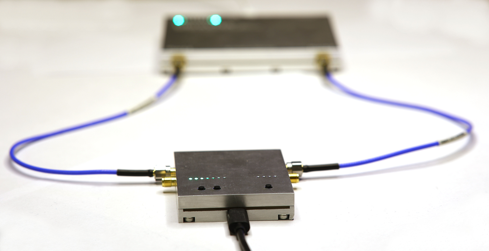
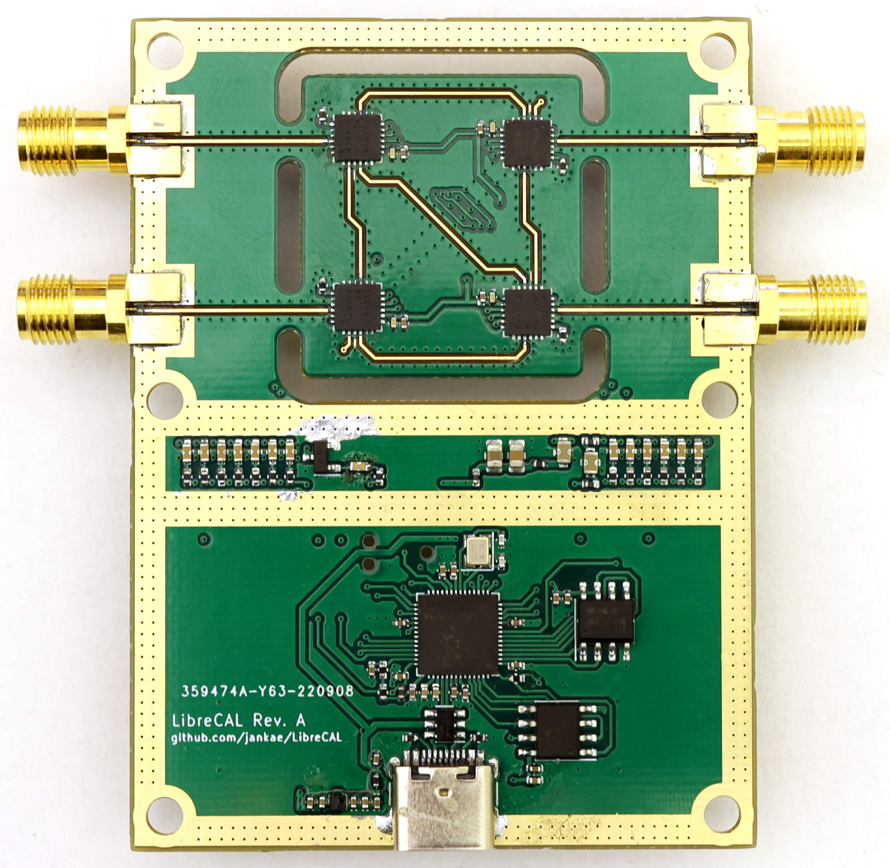
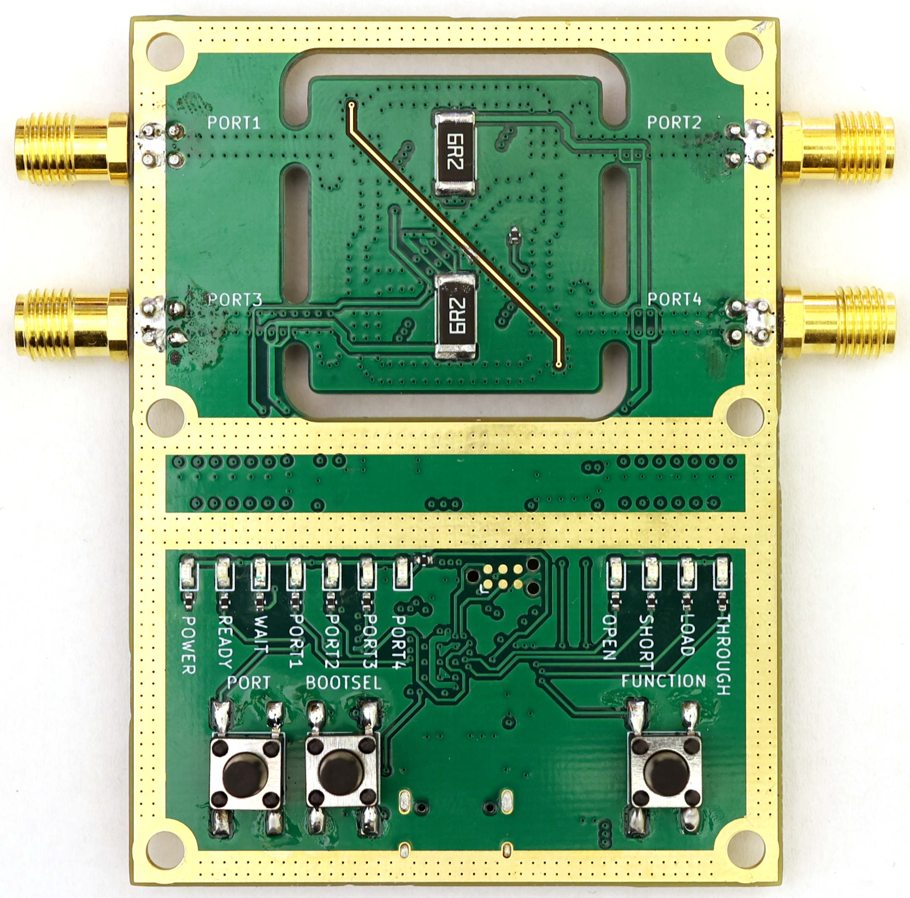
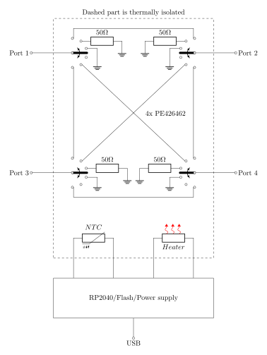

# LibreCAL
**4-port, 9kHz to 6GHz eCal module for VNAs**



<p float="center">
  
   
</p>

## Quick Start
* You can find released versions of the GUI application and the device firmware [here](https://github.com/jankae/LibreCAL/releases).
* You do *not* need the LibreCAL-GUI if you are controlling the device manually, via a script or through the [LibreVNA-GUI](https://github.com/jankae/LibreVNA).
* If you would like to try out the newest features, the compiled versions of each commit can be found [here](https://github.com/jankae/LibreCAL/actions) (but keep in mind that some features might be unstable or incomplete).
* Please see the [user manual](Documentation/manual.pdf) for details of operation.
* If you would like to control the LibreCAL with a script, see the [SCPI API](Documentation/SCPI_API.pdf).

## Installation

All of the following steps are only required if you plan to use the LibreCAL-GUI. If you plan to control the LibreCAL manually with the buttons, through a script or the LibreVNA-GUI, there is no need to download the LibreCAL-GUI (but you should still install the udev rule on Linux systems).

### Windows
* Download the latest [Release](https://github.com/jankae/LibreCAL/releases) and unpack the zip file
* Start the included LibreCAL-GUI.exe
* No installation or driver is required, simply move the extracted folder somewhere convenient

### Ubuntu
* Download the latest [Release](https://github.com/jankae/LibreCAL/releases) and unpack the zip file
* Install the required libraries:
```console
sudo apt install libqt6widgets6 libqt6charts6 libqt6svg6
```
* Install the udev rule (otherwise you don't have the permissions to access the USB device):
```console
wget https://raw.githubusercontent.com/jankae/LibreCAL/main/Software/52-LibreCAL.rules
sudo cp 52-LibreCAL.rules /etc/udev/rules.d
```
* Either reboot or reload the udev rules manually:
```console
sudo udevadm control --reload-rules
sudo udevadm trigger
```
* You can now start GUI:
```console
cd $UNPACKED_ZIP_FOLDER$
./LibreCAL-GUI
```

## How does it work?
The LibreCAL is just a switch-matrix with additional options to terminate each port into an open, short or 50 Ohm connection:



While the blockdiagram is small and simple, the tricky part of any eCal module is repeatability. The LibreCAL contains an integrated heater and temperature sensor to keep the critical parts at a constant temperature during operation. Furthermore, high quality SMA connectors are used to ensure good return loss.

The coefficients of the calibration standards are stored in standard touchstone format on the device. They must be measured and written once after assembling the PCB and housing.
